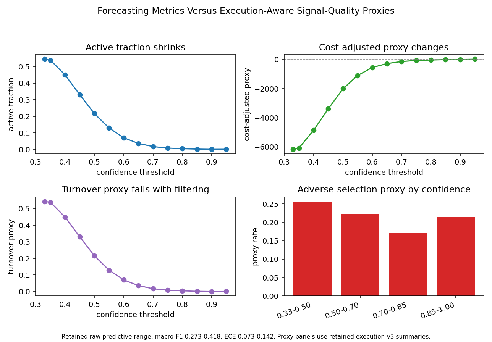

# ChronosLOB: Forecasting Quality Is Not Trading-Signal Quality

A leakage-safe FI-2010 market microstructure research platform for separating
forecast quality from execution-aware signal-quality diagnostics under explicit
confidence, cost, latency, turnover and adverse-selection proxy assumptions.

## Central Finding

ChronosLOB's central public result is not that self-supervised learning wins
broadly. It is that forecasting quality and trading-signal quality are different
evidence streams. The execution centrepiece joins retained predictive and
calibration summaries to confidence-filtered active fraction, turnover proxy,
cost-adjusted proxy, latency sensitivity and adverse-selection proxy diagnostics.



The centrepiece is an offline diagnostic over stored artefacts. It is not PnL,
not profitability evidence, not live trading evidence and not a production
execution simulator.

## What This Is

ChronosLOB is a research-engineering project for market microstructure
forecasting and validation. It focuses on reproducible FI-2010 experiments,
leakage control, calibration diagnostics, conservative feature analysis and
offline execution-aware proxy diagnostics.

ChronosLOB is a research platform for limit order book representation learning,
market-state forecasting, calibration and execution-aware validation.

It is not financial advice, not live trading infrastructure, not broker
integration and not automated order-placement software.

## Evidence Status

`archived_valid` means the retained summary/manifest evidence is complete and
content-valid, but the heavy compute was generated at an older commit or large
raw run artefacts were intentionally removed. It is not a broken-evidence status.

| Component | Current status | Notes |
| --- | --- | --- |
| Classical benchmark | `archived_valid` | FI-2010 folds 1-5 with stored aggregate artefacts. |
| Neural full grid | `archived_valid` | Folds 1-5, horizons 10/20/50, seeds 0-2, one-epoch matched grid. |
| Proper-training neural subset | `partial_real` | Fold 1, horizons 10/50, seed 0, lookback 50, max 25 epochs, patience 5; matched SSL comparisons are exact-scope only. |
| SSL comparison | `archived_valid` | Tested in the matched grid; no SSL improvement is supported. |
| SSL-v2 benchmark | `complete_real` | Market-state SSL objective vs matched supervised baseline in the exact stored seed-0 scope: folds 1-5, horizons 10/50, lookback 50. Scoped predictive improvement is supported there; seeds 1 and 2 are deferred, calibration improvement is unsupported and no broad SSL improvement is claimed. |
| Execution-v3 | `archived_valid` | Offline execution-aware proxy diagnostic only. |
| Execution-v3 analysis | `complete_real` | Richer proxy breakdown; regime diagnostics skipped; not PnL. |
| Execution centrepiece | `archived_valid` | Forecasting-versus-signal-quality gap under retained proxy diagnostics. |
| Feature ablations | `partial_real` | Logistic/ridge folds 1-5, horizons 10/20/50, seeds 0-2 plus a small gradient-boosting slice; scoped feature-stability analysis only. |
| Figures | real | Unsupported regime plots are skipped explicitly. |
| Synthetic event-level extension | `archived_valid` | Controlled synthetic event simulator; not real-market evidence; FI-2010 limits unchanged. |
| Binance Spot L2 replay path | `partial_real` | Offline snapshot-plus-diff replay path with fixture sample; supports user-supplied local Binance captures; not equity, not live trading, not profitability. |
| Manual paper | not yet written | Public reports are artefact summaries, not a manual paper. |

## Main Findings

- The strongest project hook is the execution centrepiece: forecasting quality
  and trading-signal quality diverge under confidence, cost, latency, turnover
  and adverse-selection proxy diagnostics.
- Gradient boosting remains the strongest stored classical benchmark in the
  current artefacts.
- The completed matched neural grid compares supervised, masked-SSL and
  next-field-SSL transformer variants across folds 1-5, horizons 10/20/50 and
  three seeds.
- SSL pretraining did not improve the matched one-epoch full-grid results.
- The proper-training neural subset is separate longer-training modelling
  evidence. In the current partial-real slice (fold 1, horizons 10/50, seed 0,
  lookback 50), masked reconstruction improved macro-F1 and MCC on both
  horizons, next-field improved those metrics only at horizon 50, and ECE
  worsened in every matched SSL row. This is a narrow exact-scope result, not a
  broad SSL improvement claim.
- A dedicated SSL analysis report
  (`reports/ssl_failure_analysis/ssl_failure_analysis.md`, built by
  `analyse-fi2010-ssl-results`) separates the completed one-epoch matched grid
  from the partial longer-training subset. The analysis does not support a broad
  SSL improvement claim; the only positive predictive-metric signal is narrow to
  fold 1, horizon 50 in the partial proper-training subset, while calibration
  worsened.
- SSL-v2 is a scoped empirical follow-up, not the main hook. In the
  complete-real seed-0 scope (folds 1-5, horizons 10/50, lookback 50), mean
  macro-F1 (+0.028) and MCC (+0.057) deltas support a predictive-metric
  improvement for exactly that stored slice. The multi-seed harness exists, but
  seeds 1 and 2 are deferred. ECE still worsens on average (+0.005), while Brier
  improves (-0.030), so calibration improvement and broad SSL improvement claims
  remain unsupported.
- The one-epoch matched full grid is separate from the earlier 25-epoch
  reduced-scope neural benchmark.
- Execution-v3 is an offline cost-adjusted proxy diagnostic, not PnL or
  live-trading evidence.
- An execution centrepiece report summarises the forecasting-versus-signal-quality
  gap under confidence, cost, latency, turnover and adverse-selection proxy
  diagnostics.
- Feature-ablation evidence now supports a scoped feature-stability analysis:
  removing `snapshot_order_flow_proxy` degraded macro-F1 across the tested
  logistic/ridge horizons 10/20/50 and in a small gradient-boosting slice. It is
  a labelled snapshot proxy, not true event-level OFI.

## What This Does Not Claim

- No live trading.
- No profitability claim.
- No PnL claim.
- No SOTA claim.
- No foundation-model claim.
- No production execution simulator claim.
- No tradable-alpha claim.
- No true event-level OFI from FI-2010.
- No queue-position modelling from FI-2010.
- No claim that synthetic results transfer to real markets.

A separate synthetic event-level extension adds a deterministic synthetic
limit-order-book simulator with known regimes and genuine event-level features.
It is a controlled stress-test environment, not real-market evidence, and it does
not change any FI-2010 limitation. See
[docs/SYNTHETIC_LOB_EXTENSION.md](docs/SYNTHETIC_LOB_EXTENSION.md).

A Binance Spot L2 replay extension ingests a local depth snapshot plus
diff-depth stream and reconstructs the book offline with snapshot-plus-diff
update-id logic. The committed sample is a Binance-shaped synthetic fixture;
users may supply local captures. Binance diff-depth updates are aggregated level
updates, not individual order events. It is crypto-market engineering evidence
only: not equity-market evidence, not live trading and not profitability
evidence. See [docs/BINANCE_L2_EXTENSION.md](docs/BINANCE_L2_EXTENSION.md).

## Inspect The Evidence

| Evidence | Path |
| --- | --- |
| Final empirical report | [reports/chronoslob_final_empirical_report.md](reports/chronoslob_final_empirical_report.md) |
| Evidence pack summary | [reports/evidence_pack/evidence_pack_summary.md](reports/evidence_pack/evidence_pack_summary.md) |
| Execution centrepiece | [reports/execution_centrepiece/execution_centrepiece.md](reports/execution_centrepiece/execution_centrepiece.md) |
| Proper-training neural subset | [experiments/fi2010_neural_proper_training_subset_v2/README.md](experiments/fi2010_neural_proper_training_subset_v2/README.md) |
| Claim audit | [reports/evidence_pack/claim_audit.md](reports/evidence_pack/claim_audit.md) |
| Feature-ablation stability analysis | [reports/feature_ablation_analysis/feature_ablation_analysis.md](reports/feature_ablation_analysis/feature_ablation_analysis.md) |
| Synthetic event-level extension | [docs/SYNTHETIC_LOB_EXTENSION.md](docs/SYNTHETIC_LOB_EXTENSION.md) |
| Synthetic extension report | [reports/synthetic_lob_extension/synthetic_lob_report.md](reports/synthetic_lob_extension/synthetic_lob_report.md) |
| Binance L2 replay extension | [docs/BINANCE_L2_EXTENSION.md](docs/BINANCE_L2_EXTENSION.md) |
| Binance L2 replay report | [reports/binance_l2_extension/binance_l2_report.md](reports/binance_l2_extension/binance_l2_report.md) |
| Reproduction commands | [reports/evidence_pack/reproduction_commands.md](reports/evidence_pack/reproduction_commands.md) |
| Figure index | [docs/FIGURE_INDEX.md](docs/FIGURE_INDEX.md) |
| Execution-v3 docs | [docs/EXECUTION_VALIDATION_V3.md](docs/EXECUTION_VALIDATION_V3.md) |
| Feature docs | [docs/MICROSTRUCTURE_FEATURES.md](docs/MICROSTRUCTURE_FEATURES.md) |
| Feature-ablation docs | [docs/FEATURE_ABLATIONS.md](docs/FEATURE_ABLATIONS.md) |
| Project status | [docs/PROJECT_STATUS.md](docs/PROJECT_STATUS.md) |
| Reproducibility | [docs/REPRODUCIBILITY.md](docs/REPRODUCIBILITY.md) |
| CLI reference | [docs/CLI_REFERENCE.md](docs/CLI_REFERENCE.md) |
| Safety and limitations | [docs/SAFETY_AND_LIMITATIONS.md](docs/SAFETY_AND_LIMITATIONS.md) |
| Roadmap | [ROADMAP.md](ROADMAP.md) |

## Reproduce

Install the package with development and Torch dependencies:

```bash
python -m venv .venv
source .venv/bin/activate
python -m pip install --upgrade pip
python -m pip install -e ".[dev,torch]"
```

On Windows PowerShell:

```powershell
python -m venv .venv
.\.venv\Scripts\Activate.ps1
python -m pip install --upgrade pip
python -m pip install -e ".[dev,torch]"
```

The evidence-pack reproduction entry point is:

```bash
python -m chronoslob.cli build-evidence-pack \
  --out reports/evidence_pack \
  --neural-full-grid experiments/fi2010_neural_full_grid \
  --figures reports/figures/fi2010_neural_full_grid \
  --execution-v3 experiments/fi2010_execution_v3 \
  --execution-centrepiece reports/execution_centrepiece \
  --feature-ablations experiments/fi2010_feature_ablations \
  --feature-ablation-analysis reports/feature_ablation_analysis \
  --ablation-figures reports/figures/fi2010_feature_ablations \
  --proper-training experiments/fi2010_neural_proper_training_subset_v2 \
  --final-report reports/chronoslob_final_empirical_report.md \
  --binance-l2 reports/binance_l2_extension \
  --strict \
  --overwrite
```

For the full command list, see
[reports/evidence_pack/reproduction_commands.md](reports/evidence_pack/reproduction_commands.md).

Quality gates:

```bash
python -m pytest
python -m ruff check .
python -m mypy chronoslob
python -m chronoslob.cli doctor
python -m chronoslob.cli inspect-release-readiness
python -m chronoslob.cli run-project-audit --strict
```

## Repository Structure

```text
chronoslob/  data, features, labels, models, training, diagnostics and analysis
configs/     YAML configs for data, models and experiments
docs/        protocol, evidence, feature, figure and safety documentation
reports/     public reports, evidence pack and generated figure artefacts
experiments/ stored FI-2010 evidence artefacts
tests/       deterministic tests and tiny synthetic fixtures
```

## Data Policy

No real exchange data, licensed data, private data, API keys or credentials are
committed. Tiny files under [tests/fixtures](tests/fixtures/) are synthetic and
exist only to exercise deterministic code paths.

## Licence

Released under the [MIT Licence](LICENSE).
