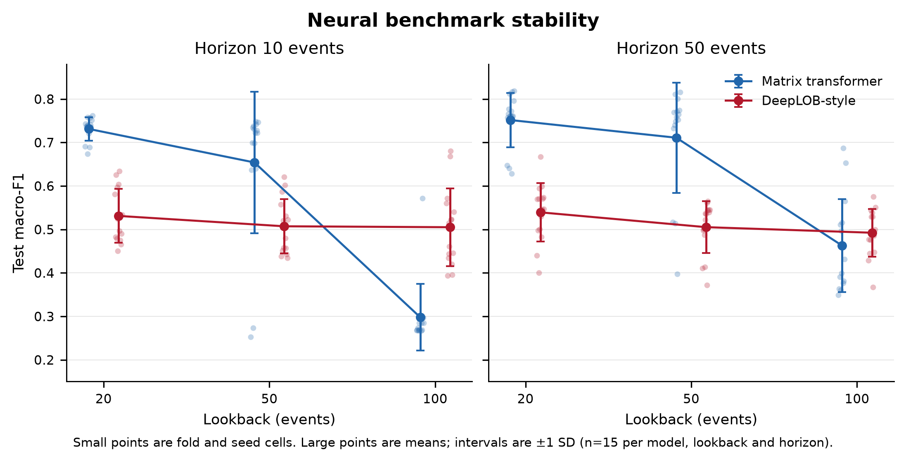
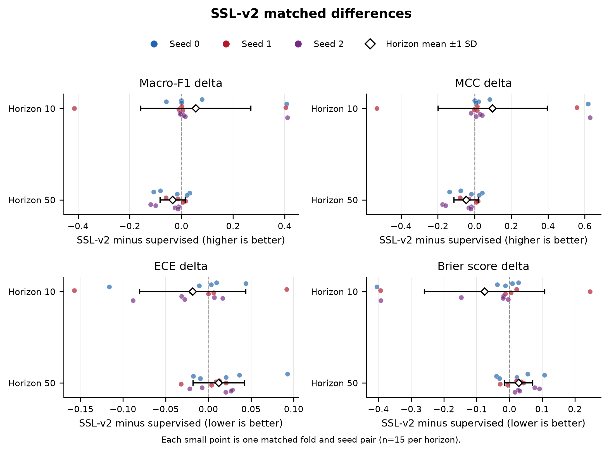
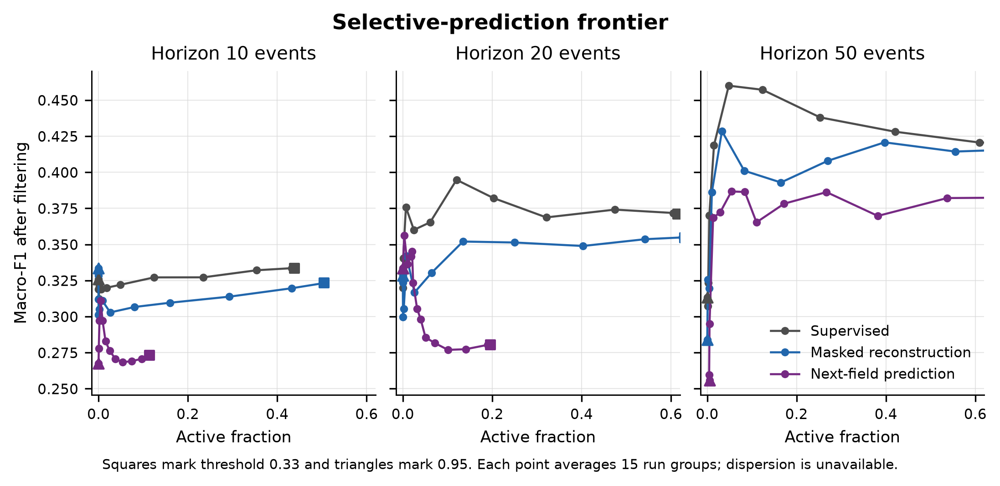
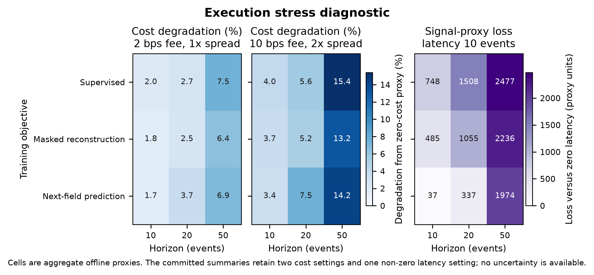
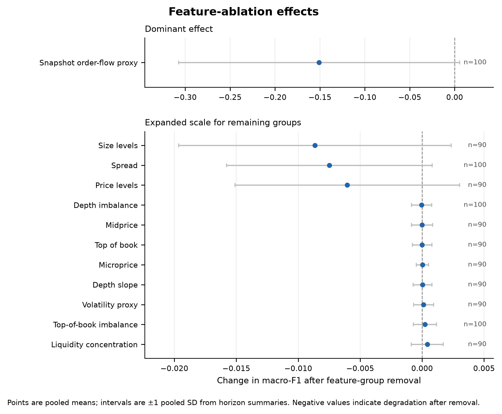

# ChronosLOB

Leakage-safe limit order book forecasting with calibrated neural benchmarks and
execution-aware offline diagnostics.

### Research Paper

📄 **[ChronosLOB: Limit Order Book Forecasting with Execution-Aware Validation](paper/ChronosLOB.pdf)**

## Research question

How much of a short-horizon FI-2010 forecasting result survives variation in model,
lookback, horizon, fold and seed, and how does that forecast behave after confidence
filtering, latency and explicit cost assumptions are introduced?

ChronosLOB separates predictive evaluation from execution interpretation. Official
chronological folds, train-only preprocessing and held-out test evaluation protect the
forecasting comparison from temporal leakage. Confidence coverage, turnover, cost and
latency are then analysed as offline signal-quality proxies, not as realised trading
returns.

## Main empirical finding

The matrix transformer has the stronger overall neural mean, with macro-F1
`0.6013 ± 0.1950` across 90 cells, compared with `0.5133 ± 0.0670` for the
DeepLOB-style model. That advantage is not stable across lookbacks. At lookback 100 the
matrix transformer falls to `0.2978 ± 0.0767` at horizon 10 and `0.4627 ± 0.1070` at
horizon 50, while its lookback-20 means are `0.7311` and `0.7515`. The principal result
is therefore sensitivity, not a universal model ranking.

<p align="center">
  
</p>

Small points are individual fold and seed cells. Large points show the mean and the
intervals show one sample standard deviation. Each model, lookback and horizon point has
15 observations. These cells share folds and experimental structure, so the intervals
are descriptive rather than independent-sample inference.

## Neural benchmark results

The validation-selected neural benchmark contains 180 supervised runs: two model families, five
official folds, three seeds, three lookbacks and horizons 10 and 50. Models train for at
most 25 epochs with validation macro-F1 early stopping, patience 5 and restoration of
the best validation checkpoint.

| Model | Horizon | Lookback 20 | Lookback 50 | Lookback 100 |
| --- | ---: | ---: | ---: | ---: |
| Matrix transformer | 10 | 0.7311 ± 0.0267 | 0.6539 ± 0.1626 | 0.2978 ± 0.0767 |
| Matrix transformer | 50 | 0.7515 ± 0.0624 | 0.7109 ± 0.1267 | 0.4627 ± 0.1070 |
| DeepLOB-style | 10 | 0.5310 ± 0.0619 | 0.5071 ± 0.0625 | 0.5050 ± 0.0896 |
| DeepLOB-style | 50 | 0.5392 ± 0.0670 | 0.5051 ± 0.0599 | 0.4923 ± 0.0549 |

Values are test macro-F1 means ± sample SD across 15 related fold and seed cells. The
committed [per-cell results](experiments/selected_results/proper_training/results_summary.csv)
also retain accuracy, MCC, Brier score, ECE and class-level F1.

## SSL-v2 results

Market-state SSL-v2 is compared with its matched supervised baseline over 30 pairs. The
overall mean deltas are `+0.0112` macro-F1, `+0.0259` MCC, `-0.0030` ECE and `-0.0235`
Brier score. Lower ECE and Brier scores are preferable. The aggregate obscures a clear
horizon interaction:

| Horizon | Pairs | Δ macro-F1 | Δ MCC | Δ ECE | Δ Brier |
| ---: | ---: | ---: | ---: | ---: | ---: |
| 10 | 15 | +0.0559 | +0.0978 | -0.0182 | -0.0755 |
| 50 | 15 | -0.0335 | -0.0460 | +0.0122 | +0.0284 |

<p align="center">
  
</p>

Every small point is a matched fold and seed difference. Diamonds and intervals are the
horizon mean ± one sample SD. The comparison supports an improvement at horizon 10,
not a general benefit from self-supervised pretraining.

## Execution diagnostic results

Confidence filtering rapidly reduces the fraction of active directional predictions,
and the relationship with macro-F1 differs by objective and horizon. Each frontier point
is an aggregate over 15 run groups. The selected summaries do not retain dispersion for
these threshold aggregates.

<p align="center">
  
</p>

The execution stress table contains two cost settings and one non-zero latency
setting. Under the supervised objective, degradation from the zero-cost proxy rises from
`2.0%` at horizon 10 to `7.5%` at horizon 50 for a 2 bps fee and one spread unit. At the
10 bps, two-spread setting it rises from `4.0%` to `15.4%`. These are sensitivity
diagnostics based on unit payoffs, not estimates of fills, market impact, PnL or
tradability.

<p align="center">
  
</p>

## Methodology

The main experiments use the public FI-2010 no-auction z-score matrices. The official
folds define train and test partitions; the final 15% of each training partition is used
for validation. Scaling, calibration and optional SSL pretraining fit training rows only.
The official test partition is evaluated after model selection.

Feature ablations remove one snapshot-derived group at a time under the same chronological
protocol. The snapshot order-flow proxy has the largest mean removal effect, but it is a
snapshot proxy rather than event-level order flow. Intervals below are pooled sample SDs
reconstructed from the committed horizon-level counts, means and standard deviations.

<p align="center">
  
</p>

The package also provides deterministic event replay, synthetic-book generation and
Binance L2 reconstruction. Bundled fixtures test those components; they are not FI-2010
benchmark observations.

## Reproducibility

Python 3.11 or newer is required. From a clean clone:

```bash
python -m venv .venv
source .venv/bin/activate
python -m pip install --upgrade pip
python -m pip install -e ".[dev,torch,plots]"
python -m chronoslob.cli doctor
```

On Windows PowerShell, activate with `./.venv/Scripts/Activate.ps1`. Regenerate all five
public figures, in PNG and PDF form, directly from the committed summaries. The command
verifies all selected-result manifest entries before reading the plotting inputs:

```bash
python scripts/plot_results.py
```

To verify the 37 selected-result files without generating figures, run
`python scripts/plot_results.py --verify-only`.

Download `BenchmarkDatasets.zip` from the
[FI-2010 Fairdata record](https://etsin.fairdata.fi/dataset/73eb48d7-4dbc-4a10-a52a-da745b47a649)
and retain its licence and checksum information. Raw data are not distributed. Extract
the archive below `data/raw/fi2010/`, then prepare the five official folds:

```bash
python -m chronoslob.cli prepare-fi2010-multifold \
  --config configs/experiments/fi2010_multifold.yaml \
  --extracted-root data/raw/fi2010/extracted/BenchmarkDatasets \
  --processed-root data/processed/fi2010 \
  --out runs/fi2010_multifold_prepare --folds all
```

The benchmark entry points are `run-fi2010-multifold-classical`,
`run-fi2010-neural-proper-training-subset`, `run-fi2010-ssl-v2-benchmark` and
`run-fi2010-feature-ablations`. Their final configurations are under
`configs/experiments/`; `python -m chronoslob.cli COMMAND --help` documents every
argument. The exact GPU job arrays and consolidation commands are in
[`scripts/slurm/`](scripts/slurm/). Selected outputs and their integrity manifest are in
[`experiments/selected_results/`](experiments/selected_results/).

Run the repository checks with:

```bash
python -m pytest -q
python -m ruff check .
python -m mypy chronoslob
python -m chronoslob.cli doctor
git diff --check
```

## Repository structure

```text
chronoslob/                   package source
configs/                      data, model and experiment configurations
experiments/selected_results/ committed empirical summaries and manifest
figures/                      public PNG and vector PDF figures
scripts/plot_results.py       selected-results plotting entry point
scripts/slurm/                GPU job arrays and consolidation scripts
tests/                        deterministic tests and synthetic fixtures
paper/ChronosLOB.pdf          research paper
```

## Citation

Use the metadata in [`CITATION.cff`](CITATION.cff), or cite:

```bibtex
@misc{naik2026chronoslob,
  author = {Anannye Naik},
  title = {ChronosLOB: Leakage-Safe Limit Order Book Forecasting with
           Execution-Aware Diagnostics},
  year = {2026},
  url = {https://github.com/anannyenaik/chronos-lob}
}
```

## Licence

ChronosLOB is released under the [MIT Licence](LICENSE). FI-2010 and exchange data remain
subject to their source licences.
