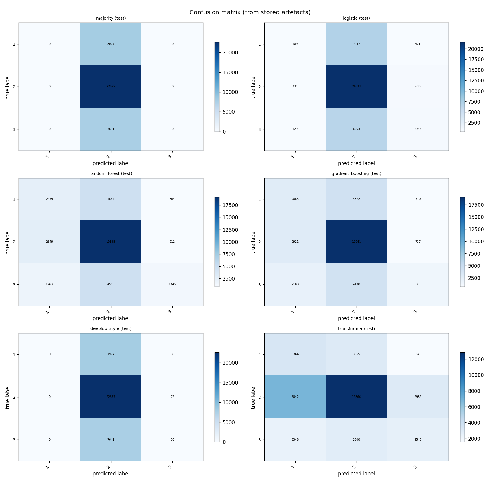
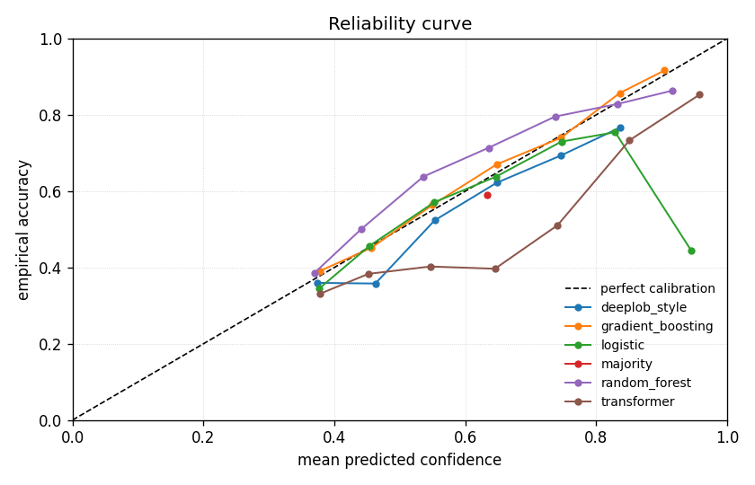
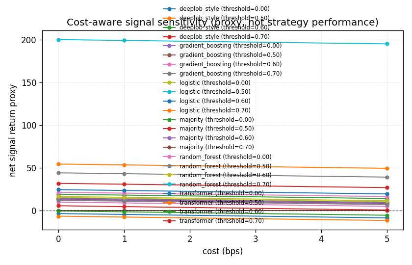

# ChronosLOB Empirical Report

## Abstract

This empirical report summarises stored artefacts for `fi2010_midprice_h10` on task `midprice_direction`.
It covers predictive results, calibration results, execution-aware sensitivity, ablation results and systems benchmarks where those artefacts were supplied.
The target research question is whether order-book representations can improve short-horizon market-state forecasting.
Evidence is bounded by leakage-safe validation, calibration analysis and explicit execution assumptions.
This report only records evidence present on disk and does not present trading or execution-system claims.
Successful model entries in the main experiment: majority, logistic, random_forest, gradient_boosting, deeplob_style, transformer.

## 1. Dataset and provenance

| field | value |
| --- | --- |
| dataset name | FI-2010 |
| dataset version | not available |
| dataset variant | midprice_direction_h10 |
| source kind | local_file |
| source path | data/processed/fi2010/fold1_combined.csv |
| source checksum | 91aef9f1923dfd87955dd5838f709ca198d8ae903cfd6baeb029fe827a0539d0 |
| row count | 77909 |
| event count | not available |
| feature count | 144 |
| runner data source kind | local_file |
| Python | 3.11.9 |
| platform | Windows-10-10.0.19045-SP0 |
| package version | 0.1.0 |

Limitations recorded in provenance: Preparation is local-only. The repository does not download FI-2010
and does not ship FI-2010 data. The tiny FI-2010-like fixture under
tests/fixtures/fi2010 exists only to exercise the preparation path
and does not represent the canonical benchmark.

## 2. Label construction

| field | value |
| --- | --- |
| task name | midprice_direction |
| label name | label_10 |
| horizon | 10 |
| label source | fi2010_existing_labels |
| label mapping | not available |
| distinct classes | 1, 2, 3 |
| class counts | 1=15483, 2=47639, 3=14787 |

Leakage details: label construction is reported from the config snapshot and preparation artefacts. Any unavailable label detail is marked as not available rather than inferred.

## 3. Leakage controls and temporal validation

| field | value |
| --- | --- |
| split design | official_column |
| split method | official_column |
| split column | split |
| official train rows | 39512 |
| official test rows | 38397 |
| official train start/end | 0 to 39511 |
| official test start/end | 39512 to 77908 |
| validation fraction within official train | 0.15 |
| total rows | 77909 |
| train rows | 33585 |
| validation rows | 5927 |
| test rows | 38397 |
| train start/end | 0 to 33584 |
| validation start/end | 33585 to 39511 |
| test start/end | 39512 to 77908 |

Stored model metadata records train-only preprocessing or tokenisation for:
- `deeplob_style standardisation`
- `deeplob_style split-contained windows`
- `logistic standardisation`
- `transformer standardisation`
- `transformer split-contained windows`
The experiment directory passed the required artefact validation contract before this report was written.

## 4. Models

| field | value |
| --- | --- |
| requested models | majority, logistic, random_forest, gradient_boosting, deeplob_style, transformer |
| successful models | majority, logistic, random_forest, gradient_boosting, deeplob_style, transformer |
| skipped models | none |

`deeplob_style` is reported as a compact DeepLOB-style supervised baseline in the stored runner metadata, not as an exact external-paper reproduction.
`transformer` and `matrix_transformer` are supervised transformer baselines over the normalised FI-2010 matrix path; raw order-book schemas remain strict and are not used to coerce z-score rows.
`ssl_transformer` is present only as planned or skipped metadata; no SSL model result is reported here.

## 5. Predictive results

The table below is populated only from `results.json`; missing metrics are marked as not available.

| model | split | horizon | accuracy | macro F1 | test count | class count test | warnings |
| --- | --- | --- | --- | --- | --- | --- | --- |
| majority | test | 10 | 0.591166 | 0.247687 | 38397 | 3 | none |
| logistic | test | 10 | 0.594343 | 0.332821 | 38397 | 3 | none |
| random_forest | test | 10 | 0.598015 | 0.443623 | 38397 | 3 | none |
| gradient_boosting | test | 10 | 0.606714 | 0.459992 | 38397 | 3 | none |
| deeplob_style | test | 10 | 0.591895 | 0.252138 | 38397 | 3 | none |
| transformer | test | 10 | 0.488931 | 0.430628 | 38394 | 3 | none |



## 6. Calibration results

`calibration_bins.csv` is present with 60 rows.

| model | split | ECE | Brier score | mean confidence | calibration rows | positive bins |
| --- | --- | --- | --- | --- | --- | --- |
| majority | test | 0.0428968 | 0.569683 | 0.634063 | 10 | 1 |
| logistic | test | 0.0168629 | 0.542817 | 0.600126 | 10 | 7 |
| random_forest | test | 0.0671087 | 0.537216 | 0.532865 | 10 | 7 |
| gradient_boosting | test | 0.0131143 | 0.519799 | 0.5978 | 10 | 7 |
| deeplob_style | test | 0.0502806 | 0.544184 | 0.642176 | 10 | 6 |
| transformer | test | 0.13484 | 0.618301 | 0.623771 | 10 | 7 |



## 7. Execution-aware sensitivity

`execution_sensitivity.csv` is present with 72 rows.

| field | value |
| --- | --- |
| confidence thresholds | 0, 0.5, 0.6, 0.7 |
| cost assumptions | 0, 1, 5 |
| latency assumptions | 0 |
| return proxy | ask_price_column=ask_price_1, bid_price_column=bid_price_1, horizon_offset=not available, kind=mid_forward_return |

| model | rows | thresholds | cost bps | latency steps | max eligible | net proxy min | net proxy max |
| --- | --- | --- | --- | --- | --- | --- | --- |
| deeplob_style | 12 | 0, 0.5, 0.6, 0.7 | 0, 1, 5 | 0 | 19588 | 8.07911 | 31.8754 |
| gradient_boosting | 12 | 0, 0.5, 0.6, 0.7 | 0, 1, 5 | 0 | 19588 | 8.06006 | 44.1651 |
| logistic | 12 | 0, 0.5, 0.6, 0.7 | 0, 1, 5 | 0 | 19588 | 9.35863 | 54.4514 |
| majority | 12 | 0, 0.5, 0.6, 0.7 | 0, 1, 5 | 0 | 19588 | 0 | 14.1198 |
| random_forest | 12 | 0, 0.5, 0.6, 0.7 | 0, 1, 5 | 0 | 19588 | 4.98478 | 199.927 |
| transformer | 12 | 0, 0.5, 0.6, 0.7 | 0, 1, 5 | 0 | 19585 | -11.5076 | 5.67986 |



These rows are proxy sensitivity under explicit assumptions, not a live or deployment-ready execution system.

## 8. Ablations and robustness

| field | value |
| --- | --- |
| ablation set | standard |
| ablations run | baseline, calibration_bins_5, cost_0bps, cost_1bps, calibration_bins_10, latency_0, latency_1, horizon_50, lookback_2, lookback_4, feature_top_of_book, feature_depth_liquidity |
| ablations skipped | ssl_pretraining_ablation, feature_imbalance |
| models requested | majority, logistic, deeplob_style, transformer |
| fixture run | no |

Ablation report paths:
- `reports/calibration_ablation.md`
- `reports/cost_sensitivity.md`
- `reports/feature_group_ablation.md`
- `reports/horizon_ablation.md`
- `reports/latency_sensitivity.md`
- `reports/lookback_window_ablation.md`
- `reports/ssl_pretraining_ablation.md`

| ablation | status | model | metric | value | source or warning |
| --- | --- | --- | --- | --- | --- |
| baseline | run | majority | accuracy | 0.5911659765085814 | experiments/baseline |
| baseline | run | majority | macro_f1 | 0.24768670071144863 | experiments/baseline |
| baseline | run | majority | expected_calibration_error | 0.042896849157638695 | experiments/baseline |
| baseline | run | logistic | accuracy | 0.594343308070943 | experiments/baseline |
| baseline | run | logistic | macro_f1 | 0.33282132091497396 | experiments/baseline |
| baseline | run | logistic | expected_calibration_error | 0.016862852538349342 | experiments/baseline |
| baseline | run | deeplob_style | accuracy | 0.5918952001458447 | experiments/baseline |
| baseline | run | deeplob_style | macro_f1 | 0.25213778820428207 | experiments/baseline |
| baseline | run | deeplob_style | expected_calibration_error | 0.050280577884349024 | experiments/baseline |
| baseline | run | transformer | accuracy | 0.48893056206698965 | experiments/baseline |
| baseline | run | transformer | macro_f1 | 0.43062799091074866 | experiments/baseline |
| baseline | run | transformer | expected_calibration_error | 0.13484028587059801 | experiments/baseline |
| calibration_bins_5 | run | majority | accuracy | 0.5911659765085814 | experiments/calibration_bins_5 |
| calibration_bins_5 | run | majority | macro_f1 | 0.24768670071144863 | experiments/calibration_bins_5 |
| calibration_bins_5 | run | majority | expected_calibration_error | 0.042896849157638695 | experiments/calibration_bins_5 |
| calibration_bins_5 | run | logistic | accuracy | 0.594343308070943 | experiments/calibration_bins_5 |

SSL pretraining ablation status:
- `ssl_pretraining_ablation`: skipped; no traceable runner support for SSL pretraining/fine-tuning yet; ssl_transformer is not registered in the paper-runner model registry

## 9. Systems benchmarks

| field | value |
| --- | --- |
| benchmark set | standard |
| benchmarks run | loader_throughput, feature_generation_speed, experiment_runner_timing, inference_latency, memory_profile |
| benchmarks skipped | not available |
| models requested | majority, logistic |
| data source kind | local_file |
| data row count | 77909 |
| platform | Windows-10-10.0.19045-SP0 |

| benchmark | status | metric | value | unit | rows | warning |
| --- | --- | --- | --- | --- | --- | --- |
| loader_throughput | run | elapsed_seconds | 2.083211699999083 | seconds | 77909 | not available |
| loader_throughput | run | rows_per_second | 37398.5034742433 | rows/second | 77909 | not available |
| feature_generation_speed | run | elapsed_seconds | 0.15663839999979245 | seconds | 77909 | feature_generation_speed measured normalised FI-2010 matrix feature throughput; raw order-book snapshot reconstruction was not used |
| feature_generation_speed | run | rows_per_second | 497381.2296352825 | rows/second | 77909 | feature_generation_speed measured normalised FI-2010 matrix feature throughput; raw order-book snapshot reconstruction was not used |
| feature_generation_speed | run | features_per_second | 71622897.06748067 | feature_values/second | 77909 | feature_generation_speed measured normalised FI-2010 matrix feature throughput; raw order-book snapshot reconstruction was not used |
| experiment_runner_timing | run | elapsed_seconds | 12.561897899999167 | seconds | 76794 | not available |
| experiment_runner_timing | run | prediction_rows | 76794.0 | rows | 76794 | not available |
| experiment_runner_timing | run | artefact_count | 15.0 | files | 76794 | not available |
| inference_latency | run | elapsed_seconds | 0.4091441000018676 | seconds | 191970 | not available |
| inference_latency | run | latency_ms_per_window | 0.002131291868530852 | ms/window | 191970 | not available |
| memory_profile | run | peak_memory_mb | 87.12832260131836 | MiB | 77909 | not available |

## 10. Failure cases and warnings

Warning summary:

| warning group | occurrences |
| --- | --- |
| optional plot artefact missing: plots/regime_breakdown.png | 13 |
| regime breakdown plot skipped because no genuine regime data exists | 1 |
| feature-pattern ablation matched no columns | 3 |
| optional plot artefact missing: plots/reliability_curve.png | 12 |
| optional plot artefact missing: plots/cost_sensitivity.png | 12 |
| optional plot artefact missing: plots/confusion_matrix.png | 12 |
| SSL pretraining remains unsupported in the paper runner | 2 |
| feature_generation_speed measured normalised FI-2010 matrix feature throughput; raw order-book snapshot reconstruction was not used | 2 |

Detailed warning appendix:

- optional plot artefact missing: plots/regime_breakdown.png: 13 occurrence(s).
- regime breakdown skipped: no genuine regime-breakdown data is available in stored artefacts; regime evidence is not derived from row numbers or timestamps
- feature-pattern ablation matched no columns: 3 occurrence(s).
  Representative detail: ablation 'feature_imbalance' skipped: ValueError: paper experiment feature_patterns produced no matching feature columns; patterns: ['*imbalance*', '*microprice*']
- optional plot artefact missing: plots/reliability_curve.png: 12 occurrence(s).
- optional plot artefact missing: plots/cost_sensitivity.png: 12 occurrence(s).
- optional plot artefact missing: plots/confusion_matrix.png: 12 occurrence(s).
- SSL pretraining remains unsupported in the paper runner: 2 occurrence(s).
- feature_generation_speed measured normalised FI-2010 matrix feature throughput; raw order-book snapshot reconstruction was not used: 2 occurrence(s).

## 11. Limitations

- Real benchmark evidence depends on a user-supplied local FI-2010-style file.
- FI-2010 is a fixed historical benchmark and may not represent other instruments, venues or regimes.
- Execution-aware sensitivity is a simplified proxy analysis with explicit costs and latency assumptions.
- There is no broker integration or order placement in this report.
- There is no production market impact model.
- SSL results are absent unless a stored SSL model result is genuinely present in the supplied artefacts.

## 12. Reproducibility commands

```bash
python -m chronoslob.cli prepare-fi2010-benchmark --config experiments/fi2010_midprice_h10/config.yaml --data-path data/processed/fi2010/fold1_combined.csv --out experiments/fi2010_midprice_h10/preparation
```

```bash
python -m chronoslob.cli run-paper-experiment --config experiments/fi2010_midprice_h10/config.yaml --data-path data/processed/fi2010/fold1_combined.csv --out experiments/fi2010_midprice_h10 --models majority,logistic,random_forest,gradient_boosting,deeplob_style,transformer --overwrite
```

```bash
python -m chronoslob.cli build-paper-plots --experiment experiments/fi2010_midprice_h10 --overwrite
```

```bash
python -m chronoslob.cli inspect-paper-experiment --experiment experiments/fi2010_midprice_h10
```

```bash
python -m chronoslob.cli run-paper-ablations --config configs/experiments/fi2010_midprice_h10.yaml --data-path data/processed/fi2010/fold1_combined.csv --out experiments/fi2010_midprice_h10_ablations --models majority,logistic,deeplob_style,transformer --ablation-set standard --overwrite
```

```bash
python -m chronoslob.cli run-system-benchmarks --config configs/experiments/fi2010_midprice_h10.yaml --data-path data/processed/fi2010/fold1_combined.csv --out experiments/fi2010_midprice_h10_systems --benchmark-set standard --models majority,logistic --overwrite
```

```bash
python -m chronoslob.cli build-paper-report --experiment experiments/fi2010_midprice_h10 --ablations experiments/fi2010_midprice_h10_ablations --systems experiments/fi2010_midprice_h10_systems --out reports/chronoslob_empirical_report.md --overwrite
```
